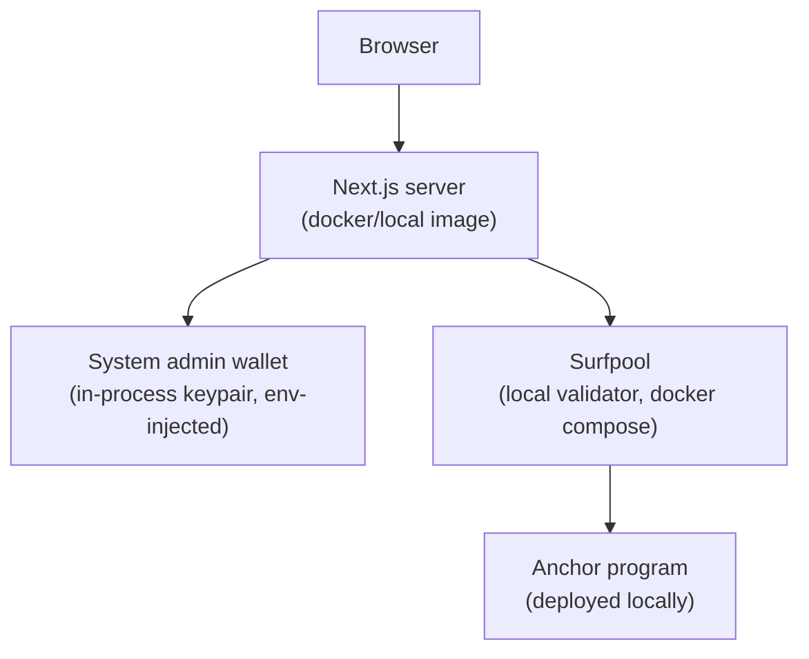
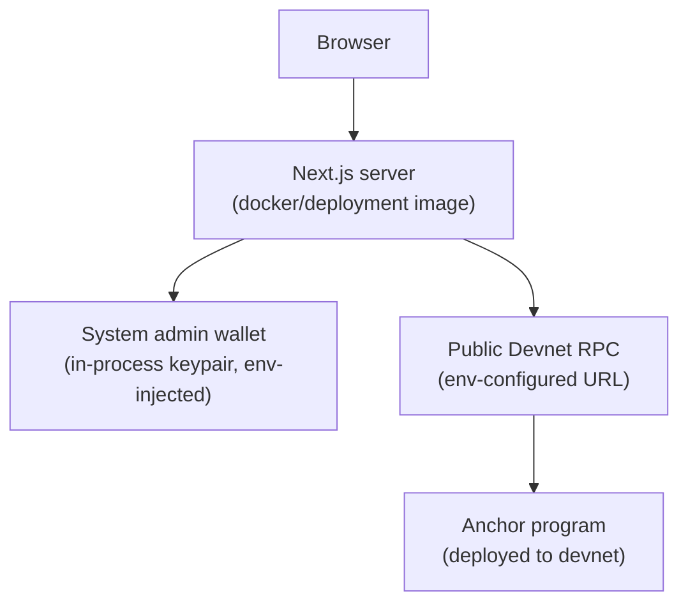

# V2 Architecture

Current-state summary of the finalized architecture. Each point below is the
**answer** from [002-architecture-decisions.md](./002-architecture-decisions.md)
(linked per section) — read that file for the reasoning behind each choice.
Open items not yet decided live in
[002-pending-discussion.md](../../business-related/002-pending-discussion.md).

---

## Wallet model

Custodial. Users authenticate with username/password only; no client ever
holds or derives a signing keypair. Every transaction is signed server-side
by the deployment's system admin wallet. The password is not a signing
secret — it's stored as a hash on the `User` account, used purely for
login/session gating. (Q1)

## Tenancy

Single global deployment: one system admin wallet, one namespace of
users/games, all visible to each other. Multi-tenancy (one program serving
multiple isolated tenants) was dropped — a party wanting an isolated
instance runs its own separate program deployment with its own system admin
wallet. (Q2, Q3)

## Discovery

A single global `Registry` PDA (`["registry"]`) holds a bounded list of
currently-open game IDs, capped at `MAX_ACTIVE_GAMES`. "Browse games" is one
deterministic account fetch, not a `getProgramAccounts` scan. User lookup by
username is a direct PDA derivation, no registry entry needed. (Q4)

## Account model

Three top-level account types, replacing V1's single `Pool` account:

- **`Registry`** — singleton, discovery index (see above).
- **`User`** — one per username, PDA seeded `["user", username,
  system_admin_pubkey]`, stores the hashed login password.
- **`Game`** — owns its own SPL mint plus an embedded, ephemeral
  current-round/pot state that resets in place each hand rather than
  persisting per-round history. (Q8, Q17)

## Token model

One SPL (fungible) token minted per game, **2 decimals** (not Solana's
default 6/9). Game membership is tracked implicitly via the
existence/balance of a player's per-game ATA — no separate on-chain
membership list. (Q9, Q15–17)

## Game modes

Same program, different instruction sets per mode:

- **General Mode** — direct player-to-player transfers. Multi-recipient
  transfers are client-composed (N single-recipient instructions, chunked
  across transactions), not a batched on-chain instruction. (Q14)
- **Poker (Holdem) Mode** — token/pot accounting only, no on-chain betting
  engine (no turn order, check/call/raise/fold, or hand ranking). Two
  primitives: `transfer` (contribute to the active pot) and `showhand`
  (all-in). Side pots are derived mechanically from contributor/showhand
  event order; admin declares winners per pot from that pot's contributor
  list. (Q5, Q6/Q7, Q9)
- **General Pool Mode** — single continuous pool for the game's lifetime, no
  rounds, no showhand, no eligibility restriction. Admin can pay out any
  amount to any player at any time — fully admin-discretionary by design.
  (Q10)

## Game lifecycle

- Quitting mid-round forfeits any tokens already sitting in an active/frozen
  pot — no refunds, same as a real-life fold. (Q11)
- `close_game` burns all outstanding balances (player wallets and any
  pot/pool accounts), then closes the game's token accounts and mint back to
  the system admin, reclaiming rent. Not blocked on active-round state. (Q12)
- Game admin can transfer their role to another existing player; the
  outgoing admin remains a regular player. Single admin only, no co-admin
  concept. (Q13)
- `delete_user` is rejected while the user is still an active player in any
  game; membership is checked via the client-supplied list of the user's
  currently-open per-game ATAs. (Q15–17)

## Infrastructure Architecture

Runtime topology — same shape in both environments, only the RPC endpoint
and program deployment target differ:

- The browser talks only to the Next.js server (Server Actions). There is no
  client-side wallet and no direct browser → RPC/program traffic.
- The Next.js server is the only component holding the system admin wallet
  keypair — the sole signer for every transaction, injected via environment
  variable at container runtime, never baked in at build time.
- **Local dev:** the `docker/local` Next.js dev image talks to Surfpool (a
  local validator), both brought up via root `docker-compose.yml`; the
  program is deployed locally against it.
- **Devnet:** the `docker/deployment` production Next.js image talks to a
  public Solana devnet RPC URL (self-hoster-configured via env var); the
  program is deployed to devnet, with the program ID read from env rather
  than the Anchor IDL's hardcoded address.

**Local Dev:**

**Devnet:**

See [003-TECH-STACK.md](./003-TECH-STACK.md)'s CI/CD & Deployment section for
how code moves from PR to deployed image/program (pipeline stages, Docker
build) and for the local-dev vs. CI-e2e compose-file distinction
(`docker-compose.yml` vs. `docker-compose.e2e.yml`) — not repeated here.

---

See [002-architecture-decisions.md](./002-architecture-decisions.md) for the
full Q&A record, and [003-TECH-STACK.md](./003-TECH-STACK.md) for how this
maps onto concrete tooling/framework choices.
