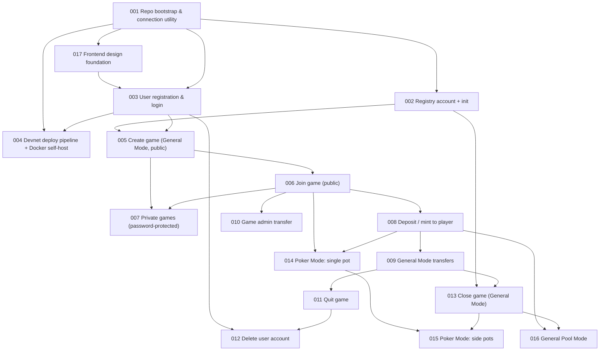

# V2 Tickets — Index

Tracer-bullet vertical slices for the V2 rebuild (new repo), derived from
[001-PRD.md](../business-related/001-PRD.md) and the architecture decisions in [002-architecture-decisions.md](../technical-related/architecture/002-architecture-decisions.md).
Each ticket is a complete path through on-chain program, Server Action, and
frontend for one user-visible capability. Numbered in dependency order —
work the frontier (any ticket whose blockers are all done).

Open questions not yet resolved (hashing algorithm, exact numeric caps,
CI stage gating, deposit conversion rate, etc.) are tracked in
[002-pending-discussion.md](../business-related/002-pending-discussion.md) — check it before implementing a ticket that
touches one of those areas.

| #   | Title                                     | Blocked by | Status  |
| --- | ----------------------------------------- | ---------- | ------- |
| 001 | Repo bootstrap & connection utility       | None       | Done    |
| 002 | Registry account + init                   | 001        | Done    |
| 003 | User registration & login                 | 001, 017   | Pending |
| 004 | Devnet deploy pipeline + Docker self-host | 001, 003   | Pending |
| 005 | Create game (General Mode, public)        | 002, 003   | Pending |
| 006 | Join game (public)                        | 005        | Pending |
| 007 | Private games (password-protected)        | 005, 006   | Pending |
| 008 | Deposit / mint to player                  | 006        | Pending |
| 009 | General Mode transfers                    | 008        | Pending |
| 010 | Game admin transfer                       | 006        | Pending |
| 011 | Quit game                                 | 009        | Pending |
| 012 | Delete user account                       | 003, 011   | Pending |
| 013 | Close game (General Mode)                 | 002, 009   | Pending |
| 014 | Poker Mode: single pot                    | 006, 008   | Pending |
| 015 | Poker Mode: side pots                     | 014, 013   | Pending |
| 016 | General Pool Mode                         | 008, 013   | Pending |
| 017 | Frontend design foundation                | 001        | Done    |

## Dependency diagram

